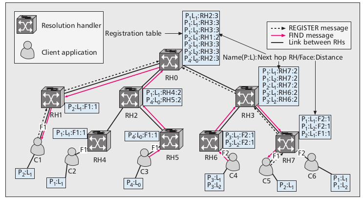

# ACNProject

## Introduction
This is a Encrypted file sharing system over Information Centric Networks following the Data oriented Network(DONA) architecture. RSA Encryption has been applied using private-public key pair. 

## Architecture

Every content in DONA is associated with a publishing entity called a Principle
(owner). Names in DONA are of the form P:L,
where P is cryptrographic hash of public key and L is an owner assigned label. Meta-data associated with each content con-
tains the full public key and digital digest signed
by the owner. The P part of the name ensures
provenance and the signature in the meta-data
ensures content integrity.
public key and L is an owner assigned label.
Name resolution is performed using
the route-by-name paradigm deployed above the
IP layer. Name resolution entities are referred to
as resolution handlers (RHs). Each domain or
administrative entity owns one logical RH. These
RHs are organized hierarchically following the
organizational and social structure of the Inter-
net. The resolution infrastructure offers
a very simple interface, providing only two oper-
ations: FIND(P:L) and REGISTER(P:L).
FIND(P:L) locates the object named P:L, while
REGISTER(P:L) sets up necessary states in the
RHs to route subsequent FIND messages effec-
tively. Routing between the RHs is performed
directly on the name.

## Working
* For Starting Resolution Handler: python3 RH.py [Label] [ParentLabel]
* For Starting Client: python3 Client.py [ClientLable] [RouterLabel]

### Commands
* Register [Filename]
* Find [FileName]

## Prerequisites
Python Packages on machine where services are to be run:
* Crypto
* base64
* os
* json
* sys
* re
* random
* threading
* socket
* sleep